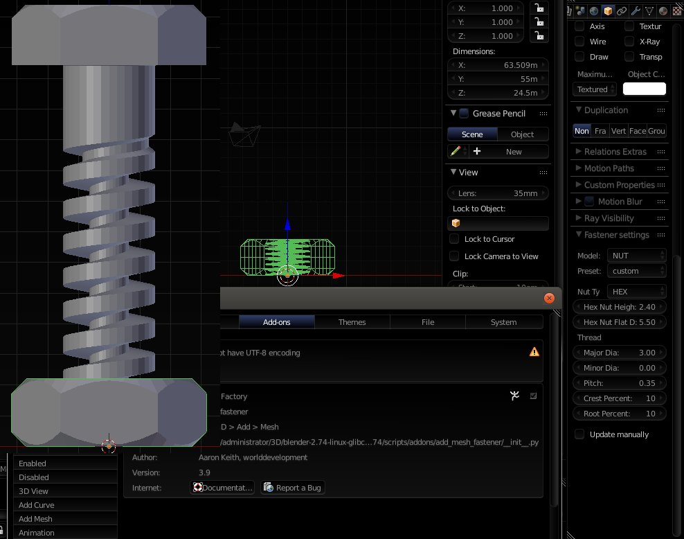
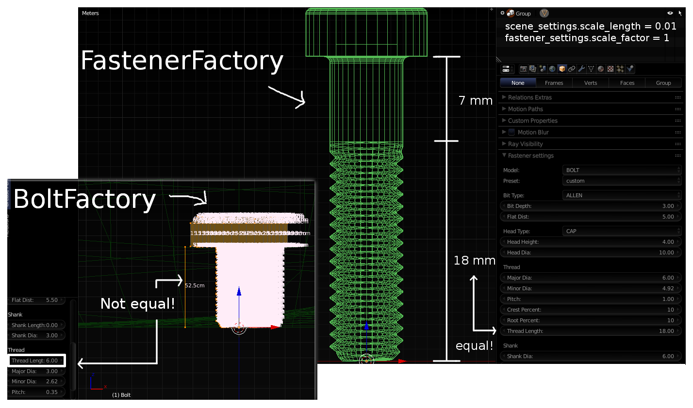

Add Mesh Fastener (Fastener Generator)
====

<a href="https://blenderartists.org/forum/showthread.php?403122-Revival-Bolt-Factory-gt-Fastener-Factory-realtime-update-any-time&p=3075739#post3075739">Blender Artists Forum Thread</a>

How to install the easy, sustained worlddevelopment way:
---
Prerequisites:
* UNIX
* Git
* blender installed as detailed in [gather and link blender addons](http://github.com/faerietree/shell__blenderaddons_gather_and_link)

Download gather and link utility by world developers:

    cd $HOME; git clone https://github.com/faerietree/shell__blenderaddons_gather_and_link
    cd $HOME; git clone https://github.com/faerietree/add_mesh_fastener
    mkdir $HOME/blender-addons-symlinks; cd $HOME/blender-addons-symlinks && ln -s ../add_mesh_fastener .
    PATH_TO_BLENDER_RELEASE=~/blendercad ~/shell__blenderaddons_gather_and_link/gather_and_link_addons.sh

Enjoy. Especially handy for developers because all updates in the symbolically linked folders are reflected instantly. If a folder or symbolic link name changes just rerun the gather, link script as shown in the last command.

Differences FastenerFactory, BoltFactory
---

